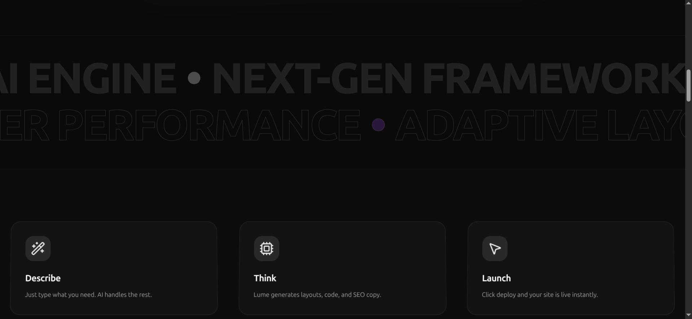
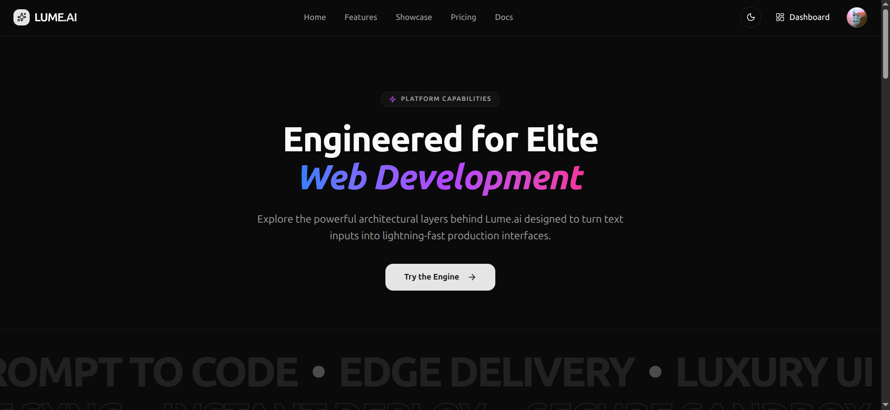
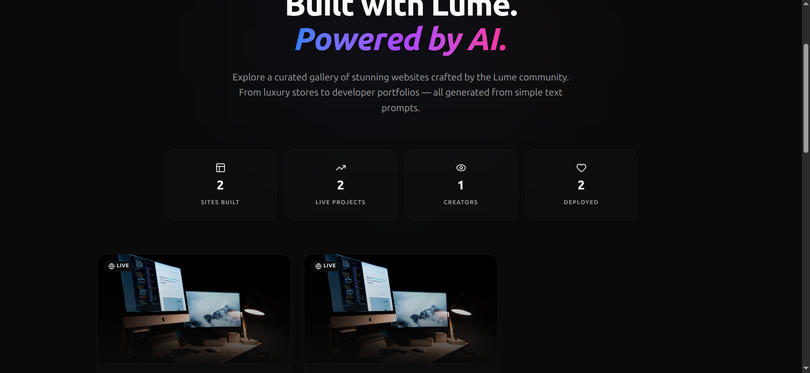
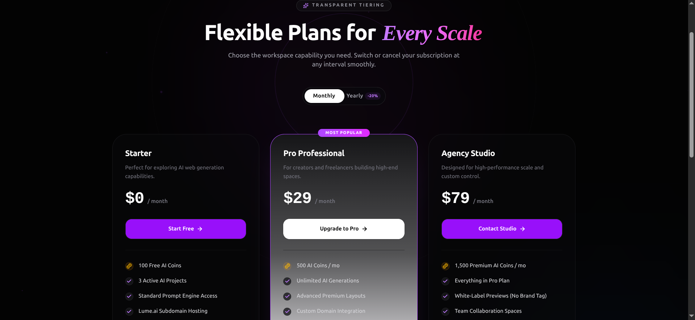
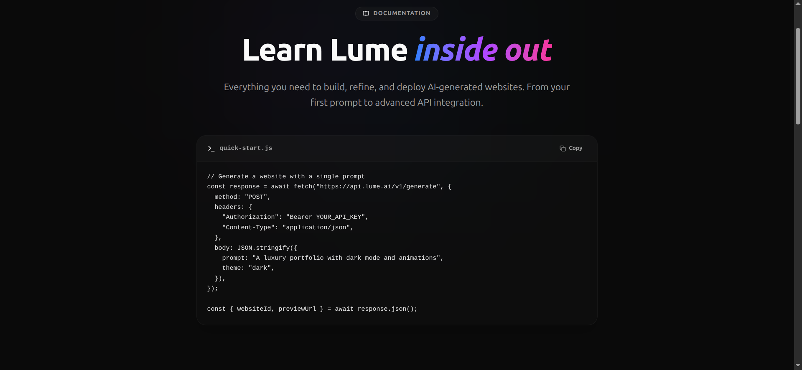
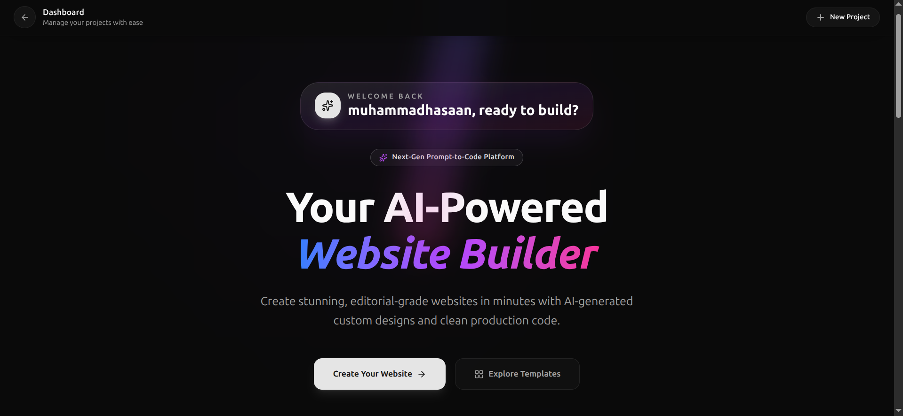
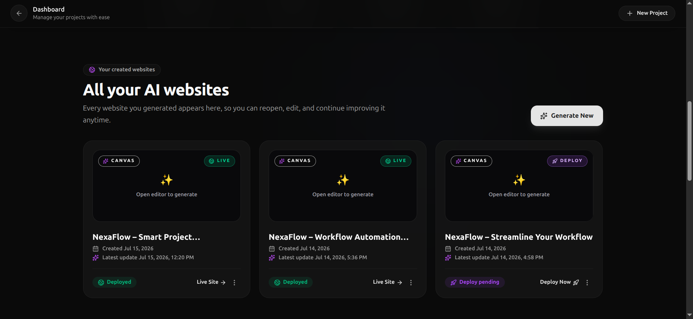
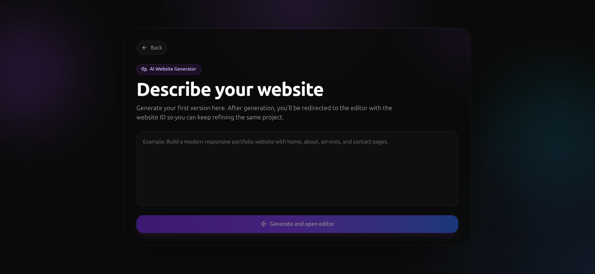
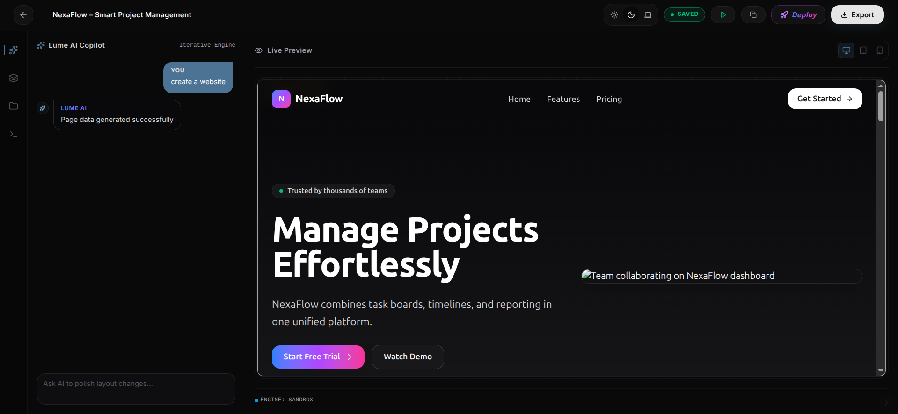

# 🚀 Lume.ai - AI-Driven Website Builder

Lume.ai is an innovative, full-stack AI-driven website builder designed to simplify and accelerate web creation. By leveraging the power of modern web technologies, Lume.ai allows users to generate clean web structures smoothly and manage them through an intuitive, interactive dashboard.

---

## ⚡ Live Demo & Source Code

- **Live Link:** [lume-ai-xi.vercel.app](https://lume-ai-xi.vercel.app/)
- **GitHub Repository:** [MuhammadHasaan546-eng/LUME_AI](https://github.com/MuhammadHasaan546-eng/LUME_AI)

---

## 📸 Application Walkthrough & Visual Tour

Here is a step-by-step look at how **Lume.ai** works from the landing page to generating and deploying a website:

### 🌐 1. Landing Page

The first touchpoint of Lume.ai, featuring a modern design, responsive layout, and clean transitions.


---

### 📊 2. Project Workspace & Creation

An intuitive dashboard where users can manage their existing web projects or initiate new website building spaces.
| Main Dashboard | Create New Project |
| :---: | :---: |
|  |  |

---

### 🤖 3. AI Generator UI & Live Rendering

Users input their natural language prompts, and Lume.ai designs custom structured layouts instantly.
| Prompt Input Field | Generated Layout Output |
| :---: | :---: |
|  |  |

---

### 🎨 4. Live Visual Editor & Settings

A clean, interactive dashboard utilizing Redux Toolkit to customize layouts, styles, and individual section structures in real-time.
| Visual Live Editor | Project Settings |
| :---: | :---: |
|  |  |

---

### ⚡ 5. Code Export & Instant Deployment

Users can seamlessly export clean React/Tailwind code structures or preview live versions of their generated sites.
| Exporting Source Code | Deployment Status |
| :---: | :---: |
|  |  |

---

## 🛠️ Tech Stack

### Frontend

- **React.js** - For building a fast, component-based user interface.
- **Redux Toolkit** - For robust global state management and handling complex asynchronous data flows.
- **Tailwind CSS** - For modern, highly responsive, and clean UI styling.

### Backend & Database

- **Node.js & Express.js** - To handle API routing, application logic, and server operations.
- **MongoDB** - For structured, secure, and flexible database management.

---

## ✨ Key Features

- 🤖 **AI-Driven Layout Generation:** Generates smart, responsive website structures based on user prompt inputs.
- 📊 **Interactive Dashboard:** A highly interactive user workspace designed to view, manage, and customize projects easily.
- ⚡ **Seamless State Management:** Leverages Redux Toolkit to ensure smooth UI transitions and real-time state updates.
- 🎨 **Refined Animations:** Integrated visual enhancements for an elite, modern look and feel.
- 📂 **Clean Code Architecture:** Developed using industry-standard folder structuring, reusable components, and optimized API routing.

---

## 🚀 Getting Started (Local Installation)

To run Lume.ai on your local machine, follow these steps:

### 1. Clone the Repository

```bash
git clone [https://github.com/MuhammadHasaan546-eng/LUME_AI.git](https://github.com/MuhammadHasaan546-eng/LUME_AI.git)
cd LUME_AI

2. Install Dependencies
Go to both frontend and backend directories and install the packages:
Bash
# For Frontend
cd client
npm install

# For Backend
cd ../server
npm install

Bash
# For Frontend
cd client
npm install

# For Backend
cd ../server
npm install
4. Run the Application
Bash
# To run backend
cd server
npm start

# To run frontend
cd client
npm start

Contact & Feedback
I am actively looking for Full-Stack / Frontend Developer opportunities! If you have any feedback or want to discuss a potential role, feel free to reach out.

GitHub: MuhammadHasaan546-eng

Live Project: Lume.ai
```
